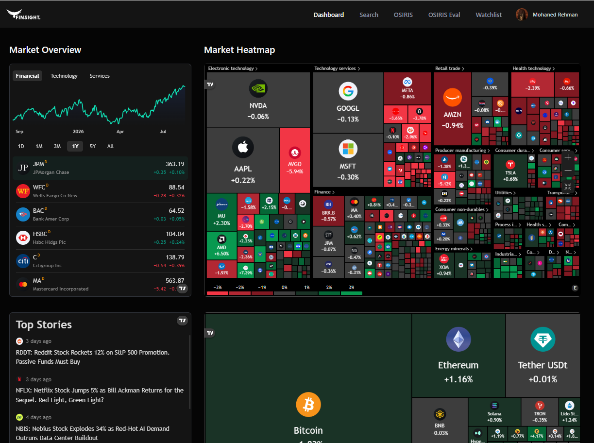
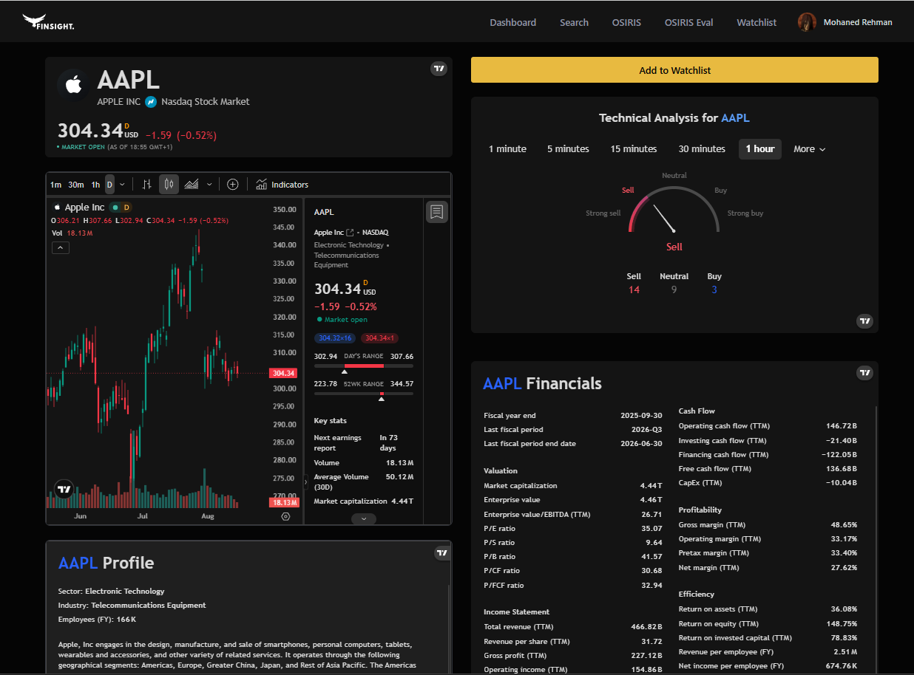
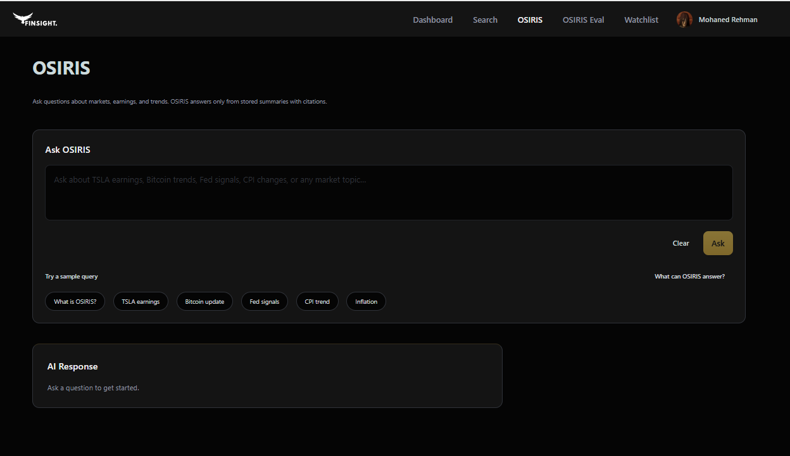
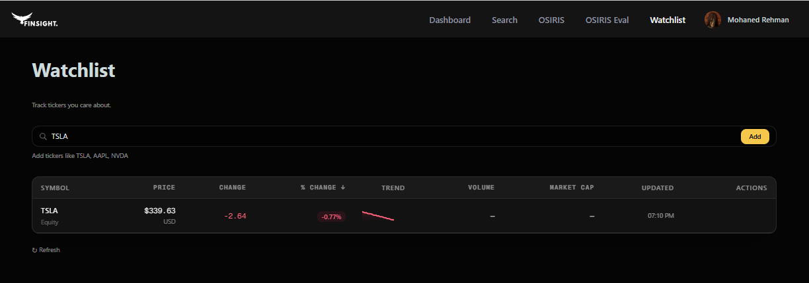
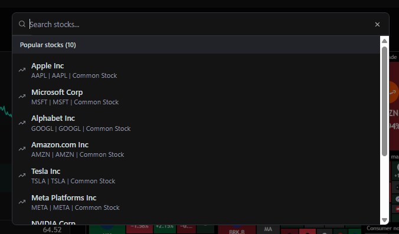
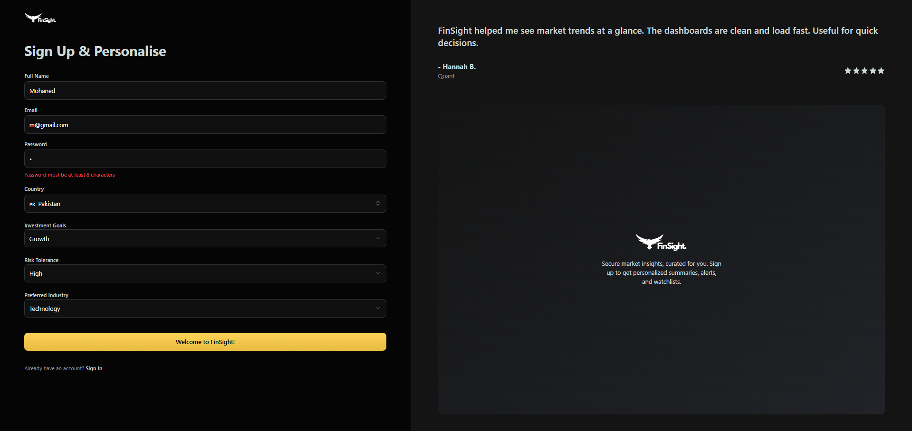
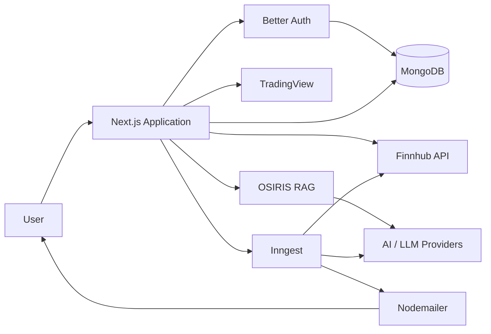

# FinSight

AI-powered financial intelligence dashboard combining live market data, watchlists, automated news summaries and retrieval-augmented research.

> **Final Year Computer Science Project - First Class Grade**

FinSight is presented here as a technical case study demonstrating the architecture, features and engineering decisions behind the project.

## Screenshots

### Dashboard

Market overview with heatmaps, top stories and at-a-glance financial trends.



### Stock Detail Page

Detailed stock analysis view with charting, technical indicators, company profile and financial metrics.



### OSIRIS

Retrieval-augmented financial research interface for citation-backed market questions.



### Watchlist

Personal watchlist functionality for tracking selected symbols and price movement.



### Search

Debounced stock search experience for quickly navigating to supported securities.



### User Onboarding

Personalised sign-up flow capturing user preferences including investment goals, risk tolerance and preferred industries, with client-side validation.



## Key Features

- Interactive financial dashboard with TradingView market widgets
- Dynamic stock detail pages with charting, technical analysis, company profiles and financial data
- Stock search with debounced API requests
- User authentication and protected routes
- Personal watchlists backed by MongoDB
- Automated financial-news summaries based on watchlist symbols
- Background workflows powered by Inngest
- AI-generated email content delivered through Nodemailer
- OSIRIS retrieval-augmented research workflow with citation-backed responses
- Personalised onboarding based on investment preferences

## Technical Architecture



FinSight uses the Next.js App Router for the application interface and server-side logic.

Authentication is handled through Better Auth and persisted in MongoDB using Mongoose.

Market visualisation is provided through reusable TradingView integrations, while Finnhub provides stock search and financial-news data.

Inngest coordinates asynchronous workflows including onboarding and automated news-summary generation.

OSIRIS provides retrieval-augmented research functionality by combining indexed context with foundation-model responses and supporting citations.

## What I Built

### Market Dashboard

Built a reusable TradingView integration layer rather than embedding every financial widget independently.

Centralised configuration supports multiple reusable widgets including:

- Market overview
- Stock heatmaps
- Candlestick charts
- Baseline charts
- Technical analysis
- Company profiles
- Financial information

This reduced duplication and made new financial views easier to implement.

### Stock Search and Detail Pages

Implemented stock search with debounced requests to reduce unnecessary external API calls.

Dynamic stock routes provide dedicated views containing:

- Symbol information
- Candlestick charts
- Baseline charts
- Technical analysis
- Company profiles
- Financial information

### Authentication and Persistence

Integrated Better Auth with MongoDB and Mongoose.

Implemented:

- Sign-up
- Sign-in
- Session handling
- Protected routes
- Persistent user data
- Client-side validation
- User-facing authentication feedback
- Personalised onboarding preferences

Database connection caching was used to prevent unnecessary MongoDB connections during development and hot reloads.

### Watchlists and Automated News Summaries

Built a watchlist-backed financial-news workflow.

The system:

1. Identifies users and their watchlist symbols
2. Retrieves relevant company and financial news
3. Processes articles through an AI summarisation workflow
4. Generates personalised summaries
5. Delivers them through email

Inngest separates the process into background steps for user retrieval, news collection, AI summarisation and email delivery.

### OSIRIS Research Workflow

Integrated the OSIRIS retrieval-augmented generation system to support contextual financial research.

The workflow combines indexed information with foundation-model responses and returns supporting citations to improve research traceability.

## Engineering Decisions

### Reusable Financial Components

TradingView integrations were implemented through shared components and centralised configuration instead of repeatedly embedding independent widgets.

### Debounced Search

Stock-search requests are delayed while users type, reducing unnecessary requests to external financial-data APIs.

### Cached Database Connections

MongoDB connections are reused where possible to prevent unnecessary reconnections during Next.js development cycles.

### Background Processing

Scheduled and long-running processes are handled through Inngest rather than blocking interactive application requests.

### Separation of Concerns

Application responsibilities are separated across dedicated modules for:

- Authentication
- Database access
- Market-data integration
- Background jobs
- UI components
- Financial research
- AI workflows

### Secrets Management

Database credentials, authentication secrets and external API keys are managed through environment variables rather than committed to source control.

## Tech Stack

### Application

- Next.js
- React
- TypeScript
- Tailwind CSS
- Radix UI

### Data and Authentication

- MongoDB
- Mongoose
- Better Auth

### Financial Data

- TradingView
- Finnhub

### AI and Automation

- OpenAI-compatible models
- Google Generative AI
- Inngest
- Nodemailer

## Project Structure

```text
app/          Application routes, layouts and API endpoints
components/   Reusable application and UI components
database/     Database models and persistence
hooks/        Reusable React hooks
lib/          Authentication, financial data, AI and application utilities
middleware/   Route and access middleware
public/       Static assets
```

## Local Setup

### 1. Clone the repository

```bash
git clone https://github.com/mohanedrehman/FinSight.git
cd FinSight
```

### 2. Install dependencies

```bash
npm install
```

### 3. Configure environment variables

Create a `.env` file and provide the required credentials for your environment.

```env
NODE_ENV=
NEXT_PUBLIC_BASE_URL=
MONGODB_URI=
BETTER_AUTH_SECRET=
BETTER_AUTH_URL=
GEMINI_API_KEY=
OPENAI_API_KEY=
NODEMAILER_EMAIL=
NODEMAILER_PASSWORD=
INNGEST_EVENT_KEY=
NEXT_PUBLIC_FINNHUB_API_KEY=
```

Never commit production credentials or API keys.

### 4. Start the development server

```bash
npm run dev
```

Open:

```text
http://localhost:3000
```

### 5. Optional database check

```bash
npm run test-db
```

## Academic Result

FinSight was developed as my final-year Computer Science project at the University of Central Lancashire and received a **First Class grade**.

The project demonstrates practical work across full-stack development, authentication, persistent data, external APIs, asynchronous processing, AI integration, retrieval-augmented generation and financial-data visualisation.
